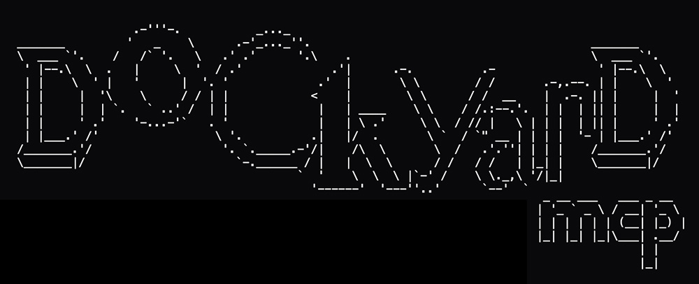

# Dockyard MCP Server
<p align="center"></p>

**Dockyard** is a **local-first** work-order system for AI-assisted development. Everything runs **on your machine**: a small **Node.js** process exposes **MCP tools** over stdio, a **Fastify** HTTP API, a **`dockyard` CLI**, and an optional **Vite** dashboard. Work orders are plain markdown and JSON on disk (default **`~/.dockyard`**), not locked inside a vendor cloud or a single editor. The design is intentionally **minimal**—few moving parts, quick startup, and predictable behavior—so agents and humans can queue, inspect, and complete work without network dependency or heavy infrastructure. Work order files are never placed within your repo, and are never referenced anywhere else to keep that sort of thing outside of git commits and kept locally. This also serves as another source of memory if you ever need to look back.

If you use Cursor, Codex, Claude Code, VS Code, or similar hosts, Dockyard fits the same **stdio MCP** model you already use for other tools. The HTTP surface is there for scripts and the browser UI; **nothing** in the core workflow requires outbound calls or accounts.

- **Dashboard & API:** `http://127.0.0.1:36969` by default (`DOCKYARD_PORT` to change). The dev dashboard is started with `dockyard dashboard on` when you want the separate Vite viewer.
- **MCP:** one process serves JSON-RPC over **stdio** for compatible clients.

## Work orders, prompts, and agent skills

**Work orders** are small, **plain markdown** jobs stored under **`DOCKYARD_ROOT`** (default **`~/.dockyard`**), grouped by calendar **`date`**, optional **`repo`** (a folder name for which codebase the work belongs to), and **`issue`** (a slug such as `auth-refactor`). Each order is a file like **`wo-001.md`**, **`wo-002.md`**, … inside that folder. Nothing is written into your git repos; the queue stays local and outside version control.

**Why the format looks like a prompt:** the body you pass to **`workorder_insert`** (or paste from the CLI/dashboard) is not free-form prose. Dockyard expects a fixed set of **`##` sections**—from **`## Objective`** through **`## Notes`**—so every task reads like a **structured brief** for an agent: what to achieve, step-by-step instructions, which files matter, what must not be touched, and what to defer. The server fills in the title line (`# Work Order: WO-NNN`), **Status**, **Created**, and assigns the canonical **`wo-NNN`** id. That consistency makes it easier for models to **parse**, **plan**, and **verify** work the same way every time.

**Typical agent loop:** split a large goal into focused orders → **`workorder_insert`** each with a full body → **`workorder_list_pending`** to see the queue → **`workorder_get`** for the markdown of a specific item → do the work in the target repo → **`workorder_complete`** when done. Before copying generated text into product code, **`workorder_validate_output`** flags obvious Dockyard-internal phrases so they do not leak into shipped files. The same lifecycle is available over **HTTP** and the **`dockyard`** CLI; full step-by-step, template, and caveats are in **[docs/agent-workflow.md](docs/agent-workflow.md)**.

**Bundled skills** (install with **`dockyard install-skills`**) teach compatible hosts **how** to use Dockyard: **`dockyard-session-guide`** (MCP **tools** vs empty **resources**, queue mindset), plus one skill per tool—**`dockyard-insert-work-order`**, **`dockyard-list-work-orders`**, **`dockyard-list-pending-work-orders`**, **`dockyard-get-work-order`**, **`dockyard-complete-work-order`**, **`dockyard-next-work-order-number`**, **`dockyard-validate-output`**—so agents get section templates, parameter reminders, and workflow text when creating or draining work orders. See **[Registering MCP and skills](#registering-mcp-and-skills)** below to wire MCP and skills into Cursor, Codex, Claude Code, VS Code, and others.

---

## Requirements

- **Node.js 20+**
- **npm**, **pnpm**, or **yarn** (for installing the package or working from source)

---

## Install from npm (recommended)

The published package includes **pre-built** `dist/` and `dashboard/dist`—**no clone, no `pnpm install` in this repo, and no `pnpm run build`** after you install from the registry.

**What you do *not* need for normal use:** running **`pnpm start`**, **`node dist/index.js`**, or any other **manual “start the server”** step. Your **MCP host** (Cursor, VS Code, Codex, Claude Code, etc.) launches the installed **`dockyard-mcp`** entrypoint when a session needs it—the same process serves **stdio MCP**, the **HTTP API**, and the **built-in dashboard** on **`DOCKYARD_PORT`**. Work orders live under **`~/.dockyard`** (or **`DOCKYARD_ROOT`**). The **`dockyard`** CLI is optional for humans and scripts; agents typically use **MCP tools** only.

After install, do the **one-time** [Registering MCP and skills](#registering-mcp-and-skills) step, then you can [prompt your agent](#example-prompt-your-agent-after-setup) in plain language. Skip [Install from source](#install-from-source-optional) unless you are developing Dockyard or must run from a local checkout.

```bash
npm install -g dockyard-mcp
dockyard --help
```

The npm package is **`dockyard-mcp`**; the CLI on your PATH is still **`dockyard`** (and **`dockyard-mcp`** is the same binary if you prefer that name).

```bash
# or, with pnpm
pnpm add -g dockyard-mcp
```

Run without a global install:

```bash
npx dockyard-mcp --help
```

The global **`dockyard`** command resolves the installed package path for **`install-agents`** / **`install-skills`** automatically.

---

## Registering MCP and skills

1. **Register MCP + skills in your editors** (only **`pnpm run build`** is required when you use a **source** checkout without the pre-built npm layout; **npm installs already ship `dist/` and `dashboard/dist`**):

   ```bash
   dockyard install-agents --list
   dockyard install-agents --dry-run
   dockyard install-agents
   ```

   ```bash
   dockyard install-skills --list
   dockyard install-skills
   ```

   Restart each host app (Cursor, VS Code, Codex, etc.) after MCP config changes. The skill **`dockyard-session-guide`** tells agents that Dockyard uses MCP **tools** (`workorder_*`), not MCP **resources** — so “list resources” may be empty while Dockyard is still available. Details and target tables: [docs/agent-workflow.md](docs/agent-workflow.md).

---

## Example: prompt your agent (after setup)

Once **`install-agents`** and **`install-skills`** are done and the host has been restarted, you can steer the model with a single chat instruction—no need to run Dockyard manually. For example:

> use dockyard and gh cli to get issue 43 from this repo and make appropriately sized work orders

If your agent wigs out and makes horrible work orders because you're using some non-smart model or something - try being super specific. But with the mcp server installed and all the skils installed the above should be enough. If not try the following:

> Use the **Dockyard** MCP tools and the **GitHub CLI** (`gh`). In this workspace’s GitHub repo, get issue **`###`** (full title, body, and any labels), then create **focused Dockyard work orders** with **`workorder_insert`**: one order per concrete unit of work, using **today’s date** (`YYYY-MM-DD`), an **`issue`** slug derived from that GitHub issue, a **`repo`** slug that matches how we organize this project (e.g. the repo or app name), and markdown **`content`** bodies that include **every** required `##` section from **Objective** through **Notes** (use the **dockyard-insert-work-order** skill). If there is already a queue, start with **`workorder_list_pending`**.

Adjust the issue reference (`###`), repo naming, and how you split work to match your team. The same idea works without GitHub: *“Use Dockyard to break the following goal into work orders …”*.

---

## Install from source (optional)

**Manual path — not required if you installed from npm.** Use this when developing Dockyard or running from a clone/tarball without the registry package.

For development or if you prefer to build yourself:

1. **Get the source** (clone, unzip a release, or copy the folder).

2. **Install dependencies** from the package root:

   ```bash
   pnpm install
   ```

   (Equivalent: `npm install`.)

3. **Optional environment file** — copy [`.env.example`](.env.example) to `.env` in the same directory if you want to set variables in one place. Dockyard also reads the shell environment.

   | Variable | Meaning |
   |----------|---------|
   | `DOCKYARD_ROOT` | Where work orders are stored (default: `~/.dockyard`) |
   | `DOCKYARD_PORT` | HTTP port (default: `36969`) |

4. **Build** (TypeScript + dashboard assets):

   ```bash
   pnpm run build
   ```

5. **Put `dockyard` on your PATH** (pick one):

   - **pnpm (recommended):** from the package root  
     `pnpm link --global`  
     Then `dockyard --help` should work in any terminal.

   - **npm:** from the package root  
     `npm link`  
     (same idea: global shim to this package’s `bin`.)

   - **Without a global link:** call the CLI by path:

     ```bash
     node /absolute/path/to/dockyard/dist/cli.js --help
     ```

   Until you link or use the full path, examples below assume `dockyard` is available.

---

## Run the server

**If you installed from npm and only use Dockyard through your editor’s MCP config, you can skip this section** — the host already starts **`node …/dockyard-mcp/dist/index.js`** for you. Use this when you are working **from a source clone** and want to run the same entrypoint yourself (debugging, or using HTTP/CLI without an IDE).

From the package root, after `pnpm run build`:

```bash
pnpm start
```

This runs `node dist/index.js`: **HTTP + dashboard** on `127.0.0.1:36969` and **MCP over stdio**. When an IDE launches Dockyard as an MCP server, it typically runs this same entrypoint; the HTTP listener still starts so the dashboard is available.

**Development** (TypeScript watch + Vite on port 5173 proxying API to 36969):

```bash
pnpm run dev
```

---

## Dashboard

- **Production / `pnpm start`:** open `http://127.0.0.1:36969` (or your `DOCKYARD_PORT`).
- **`pnpm run dev`:** use `http://127.0.0.1:5173` so the Vite dev server can proxy API calls to the backend.
- **CLI viewer:** `dockyard dashboard on` prints a URL to open. **From npm** (`dockyard-mcp`), that URL is the **HTTP API** (default `http://127.0.0.1:36969/`) serving the built dashboard—no Vite bundled. **From a dev clone** with Vite installed, it starts **Vite on 5173** (proxy to the API) when possible. A helper API process is only started if nothing is listening on `DOCKYARD_PORT`. `dockyard dashboard off` stops what `on` started.
- **Branding assets:** put `logo.jpg` (or `favicon.svg`) in [`dashboard/public/`](dashboard/public/); they are copied into `dashboard/dist` at build time and served by the API or Vite. The header tries `/logo.jpg` first, then falls back to the bundled favicon.

---

## CLI reference

All commands use `DOCKYARD_ROOT` / `DOCKYARD_PORT` from the environment unless you only touch work orders via the CLI (storage still uses `DOCKYARD_ROOT`).

### Global options

```text
dockyard --help
dockyard --version
```

### Work orders (no HTTP server required)

| Command | Purpose |
|---------|---------|
| `dockyard insert` | Create a work order from markdown **stdin** or `--file` |
| `dockyard list` | List work order ids and statuses for one issue + date |
| `dockyard pending` | List pending work orders (all issues or filtered) |
| `dockyard complete` | Mark one work order complete in the index |

**`dockyard insert`**

- **Required:** `--issue <slug>` (e.g. `auth-refactor`; stored as a normalized slug).
- **Optional:** `--repo <slug>` — folder under the date (default **`default`**, e.g. your app or git repo name).
- **Optional:** `--date YYYY-MM-DD` (default: **today** in local time).
- **Optional:** `--file <path>` — read body from file; use `-` for stdin explicitly. If omitted, body is read from **stdin**.

```bash
dockyard insert --repo my-app --issue my-feature --date 2026-03-24 < body.md
dockyard insert --issue my-feature --file body.md
```

On success, prints one line: the new id (e.g. `wo-001`). The markdown body must include every required `##` section from **Objective** through **Notes** (see [docs/agent-workflow.md](docs/agent-workflow.md)).

**`dockyard list`**

- **Required:** `--issue <slug>`
- **Optional:** `--repo <slug>` — disambiguate when several repos share an issue; use **`legacy`** for old `date/<issue>/` trees.
- **Optional:** `--date YYYY-MM-DD` (default: **today**)

Output: TSV lines `wo-001<TAB>pending` or `complete`.

```bash
dockyard list --repo my-app --issue my-feature
dockyard list --issue my-feature --date 2026-03-24
```

**`dockyard pending`**

- **Optional:** `--date YYYY-MM-DD`, `--repo <slug>`, `--issue <slug>`  
  Omit filters to list all pending work orders (sorted by date, repo, issue, id).

Output: TSV `date<TAB>repo<TAB>issue<TAB>wo-001`.

```bash
dockyard pending
dockyard pending --date 2026-03-24
dockyard pending --repo my-app
```

**`dockyard complete`**

- **Required:** `--issue <slug>`, `--date YYYY-MM-DD`, `--id wo-001`
- **Optional:** `--repo <slug>` (omit if unambiguous; **`legacy`** for old layout)

```bash
dockyard complete --repo my-app --issue my-feature --date 2026-03-24 --id wo-001
```

Silent on success; errors go to stderr.

---

### `dockyard dashboard`

| Command | Purpose |
|---------|---------|
| `dockyard dashboard on` | Print a dashboard URL: **npm install** → API + static UI on `DOCKYARD_PORT` (e.g. `36969`); **source + Vite** → Vite dev on `5173` when `vite` is installed. Starts a helper API only if nothing listens on `DOCKYARD_PORT`. |
| `dockyard dashboard off` | Stop processes recorded from the last `on` run. |

**`dockyard dashboard on`**

- **Optional:** `--package-root <path>` — repo root with `dist/`, `dashboard/`, `node_modules` (default: inferred from the CLI).

**npm install:** `dist/` and `dashboard/dist` are already present. **Source checkout:** run `pnpm run build` first if those directories are missing. Uses the same `DOCKYARD_ROOT` / `DOCKYARD_PORT` as MCP.

```bash
dockyard dashboard on
dockyard dashboard off
```

---

### `dockyard install-agents`

Writes MCP config snippets for tools whose data directories already exist under your home folder. Requires a built server: `dist/index.js`.

| Flag | Meaning |
|------|---------|
| `--list` | Print detected config files; no writes |
| `--dry-run` | Show would-write / would-skip per tool |
| `--force` | Replace existing server entry named by `--name` |
| `--name <id>` | MCP server id in JSON/TOML (default: `dockyard`) |
| `--package-root <path>` | Root of this repo (contains `dist/`) if CLI is not run from there |
| `--script <path>` | Full path to server entry instead of `<package-root>/dist/index.js` |
| `--targets <ids>` | Comma-separated: `cursor`, `codex`, `vscode`, `vscode-insiders`, `claude-code`, `claude-desktop`, `windsurf`, `gemini`, `zed` |

```bash
dockyard install-agents --list
dockyard install-agents --dry-run
dockyard install-agents
dockyard install-agents --force --targets cursor,codex
```

If `dist/index.js` is missing (typical only for a **source** tree before a build), run `pnpm run build`. **Global npm installs** already include `dist/`.

---

### `dockyard install-skills`

Copies bundled skills from `skills/` into each detected tool’s skills directory.

| Flag | Meaning |
|------|---------|
| `--list` | Print target skill directories |
| `--dry-run` | Per skill: would copy or would skip |
| `--force` | Overwrite existing skill folders with the same name |
| `--package-root <path>` | Repo root containing `skills/` |
| `--targets <ids>` | `cursor`, `codex`, `claude-code`, `gemini`, `windsurf`, `zed` |

```bash
dockyard install-skills --list
dockyard install-skills --dry-run
dockyard install-skills
```

---

## Where data lives

```text
$DOCKYARD_ROOT/
  YYYY-MM-DD/
    <repo-slug>/
      <issue-slug>/
        index.json
        wo-001.md
        ...
```

Older data may still be `YYYY-MM-DD/<issue-slug>/` (no repo segment); tools treat that as **`repo: legacy`**.

Default: `DOCKYARD_ROOT` = `~/.dockyard`.

---

## Agents and MCP

- **Tool names:** `workorder_insert`, `workorder_get`, `workorder_list`, `workorder_list_pending`, `workorder_complete`, `workorder_next_number`, `workorder_validate_output`.
- **Human-oriented workflow, HTTP table, validation caveats:** [docs/agent-workflow.md](docs/agent-workflow.md).

---

## Publishing to npm (maintainers)

1. Bump **`version`** in [`package.json`](package.json).
2. Ensure you are logged in: `npm login`.
3. From the repo root:

   ```bash
   npm publish
   ```

   The **`prepack`** script runs **`npm run build`** so the tarball always contains fresh **`dist/`** and **`dashboard/dist/`**.

4. Inspect the artifact without publishing:

   ```bash
   npm pack --dry-run
   ```

**Note:** The registry name is **`dockyard-mcp`** (see `"name"` in [`package.json`](package.json)). This repo lists **`dashboard/`** in [`pnpm-workspace.yaml`](pnpm-workspace.yaml) for local dev. Publishing uses the **root** [`package.json`](package.json) only; the published tarball is defined by the **`files`** field there (not the dashboard workspace package).

---

## Troubleshooting

| Problem | What to try |
|---------|-------------|
| `dockyard: command not found` | Run `npm install -g dockyard-mcp`, or `pnpm link --global` from a source clone, or use `node /path/to/dist/cli.js` |
| `Server script not found` on `install-agents` | From **source**, run `pnpm run build`. From **npm**, reinstall or check that the global package’s `dist/index.js` exists. |
| MCP server fails to start in the IDE | Ensure `node` is on PATH; check `DOCKYARD_ROOT` paths; restart the IDE |
| Dashboard 404 | **npm:** ensure the MCP process is running (IDE) or `dockyard dashboard on`; the API serves `dashboard/dist`. **Source:** run `pnpm run build` so `dashboard/dist` exists; `pnpm start` serves it |
| Invalid JSON error during `install-agents` | Fix the target config file the error names; the installer refuses to overwrite broken JSON |

---

## License (GNU GPL v3.0)

Dockyard is **fully open source** under the [**GNU General Public License v3.0**](LICENSE.md) (GPL-3.0). You may run, study, modify, and share this software freely. If you **distribute** a modified version (including as part of a larger product), the GPL requires that you:

- **License your changes under GPL-3.0** as well (copyleft).
- **Include** this project’s **copyright and license notices**, and **prominently note** that you changed the files.
- **Provide** corresponding **source code** to anyone who receives the program from you (as the GPL defines “convey”).

If you **fork** [this repository](https://github.com/bryanthaboi/dockyard), keep a clear link or attribution to the upstream project and retain [`LICENSE.md`](LICENSE.md) with your fork. This is a short summary, not legal advice—the full terms are in **LICENSE.md**.
___
# me
<p align="center">
<a href="https://boisclub.games">
by bryanthaboi
</a>
</p>
<p align="center">
you can support me by playing my games on steam. right now im working on a card game and the playtest is live. ill probably forget to update this text here so if the games already released and the playtest is over im sorry about that lol.
</p>
<p align="center">
<a href="https://store.steampowered.com/app/4509030/Boya_Coya?utm_source=github_dockyard">Boya Coya</a>
</p>
